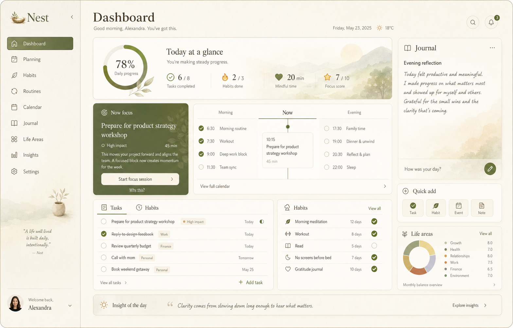
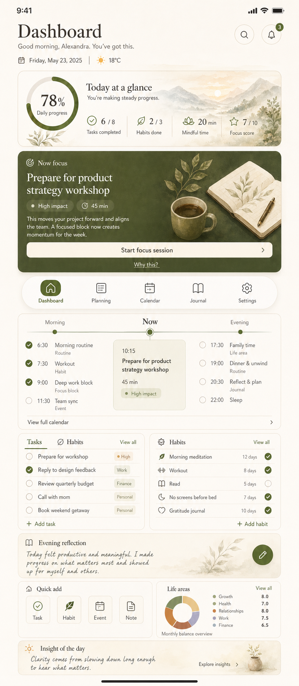

# NEST-197 Dashboard Canonical Direction (2026-04-26)

## Purpose

Define the canonical post-login dashboard direction for Nest so the dashboard
becomes:

- the primary life-command surface after authentication,
- the reference composition for future module work,
- the baseline for rewriting legacy UI into one reusable visual system.

## Source Type and Approval Context

- Source of truth type: `approved_snapshot`
- Approval context: founder-approved generated concept on 2026-04-26
- Canonical artifacts:
  - `docs/ux_canonical_artifacts/2026-04-26/nest-dashboard-canonical-preview.png`
  - `docs/ux_canonical_artifacts/2026-04-30/nest-dashboard-canonical-reference-mobile.png`
- Supporting repository truth reviewed:
  - `docs/ux/visual-direction-brief.md`
  - `docs/ux/brand-personality-tokens.md`
  - `docs/ux/design-memory.md`
  - `docs/ux/ui-ux-foundation.md`
  - `docs/ux/nest_190_full_system_ux_target_assumptions_2026-04-01.md`
  - `docs/architecture/modules.md`
  - `apps/web/src/app/dashboard/page.tsx`
  - `apps/web/src/components/workspace-shell.tsx`

## Canonical Preview

## Dashboard Job To Be Done

The dashboard is not a summary page. It is the user's calm operational desk.
Within the first viewport it must answer:

1. What matters now?
2. What deserves attention next?
3. How is today progressing across the user's life system?

This surface should reduce stress, create momentum, and make life management
feel elegant rather than administrative.

## Canonical Experience Principles

- Lead with one dominant next action before secondary information.
- Make the day readable as a living sequence, not a collection of unrelated
  widgets.
- Keep planning, execution, reflection, and balance visible in one unified
  surface.
- Use premium restraint: wow through hierarchy, rhythm, materials, and
  composition rather than loud effects.
- Preserve Nest's calm, grounded tone even when information density grows.

## Information Architecture

The canonical desktop dashboard is composed from six layers.

### 1. Global Shell

- Left navigation rail remains visible for orientation and fast module
  switching.
- Top workspace header keeps date, screen title, and one global primary action.
- Shell chrome must stay quieter than dashboard content.

### 2. Hero Progress Band

- Large editorial hero block near the top-left.
- Shows today's progress, completion ratio, and lightweight daily metrics.
- Reads as the emotional anchor of the screen, not a decorative banner.

### 3. Dominant `Now Focus` Card

- The most visually dominant actionable block.
- Contains one recommended next step with direct CTA.
- Must be stronger than the timeline and secondary panels.
- If no strong next step exists, the system proposes one calm starter action.

### 4. Daily Flow Timeline

- Structured into `Morning`, `Now`, and `Evening`.
- Represents time and energy continuity, not raw event dumping.
- `Now` receives the strongest contextual emphasis.

### 5. Core Work Panels

- `Tasks / Habits`
- `Journal / Reflection`
- `Quick actions`

These panels support the hero and `Now Focus` rather than competing with them.

### 6. Quiet System Context

- Goals, life balance, and insights appear as smaller supporting cues.
- They should remind the user that Nest is a whole-personal life workspace, not
  a task app.

## Visual Direction

### Mood

- calm utility
- editorial precision
- warm guidance
- grounded confidence

### Palette

- warm paper and beige base surfaces
- brown/ink typography
- sage and muted olive accents
- low-noise stone neutrals for supporting zones

### Surface Grammar

- avoid pure white and pure black
- layered surfaces with restrained translucency
- fine outlines and soft shadow separation
- subtle aura shapes only where they improve orientation and depth

### Hierarchy

- one hero
- one dominant action card
- two to four quieter supporting panels
- tertiary metadata recedes through size and contrast, not opacity tricks alone

## Reusable Dashboard Component Grammar

The dashboard direction must be implemented through reusable primitives, not
dashboard-only custom blocks.

### Required shared primitives

- `WorkspaceShell`
  - left rail, topbar, responsive shell spacing, aura handling
- `HeroBand`
  - large editorial summary surface with metrics and progress treatment
- `FocusCard`
  - dominant next-best-action card with title, reason, CTA, and optional
    freshness action
- `TimelineGroup`
  - titled sequence block for `Morning`, `Now`, `Evening`
- `SegmentedPanel`
  - panel with tabs or segment switcher for `Tasks` / `Habits`
- `ReflectionComposer`
  - warm quick-capture area with local save feedback and latest-entry preview
- `QuickActionCluster`
  - compact action grid prioritizing the most likely creation flows
- `ContextRibbon`
  - slim supporting strip for goals, insights, and life-area balance indicators
- `StatusPill`
  - shared chip grammar for task state, habit state, urgency, and guidance tags

### Reuse rules

- Module screens should inherit the same hero rhythm and panel language.
- If a primitive is needed by at least two modules, promote it to shared
  component status.
- Do not create route-local visual variants when tokenized component props are
  enough.

## Desktop Layout Contract

- Use width for orchestration and scanning.
- Keep the first viewport focused on:
  - hero progress,
  - `Now Focus`,
  - timeline,
  - one core execution panel.
- Avoid a flat symmetric grid.
- Use purposeful asymmetry:
  - heavier left-top composition,
  - calmer right-side supporting stack,
  - compact but legible action clusters.

## Mobile and Tablet Translation Rules

This artifact is desktop-first, but it defines cross-surface identity.

### Mobile

- Keep `Now Focus` first.
- Collapse hero metrics into one concise summary band.
- Timeline becomes vertically stacked with `Now` first when space is tight.
- Reflection stays warm and quick, never form-heavy.
- Use the mobile canonical reference as the target for hierarchy and order:
  header, hero progress, `Now focus`, mobile module nav, day flow, execution,
  reflection, quick add, life areas, and insight.

### Tablet

- Preserve split-view planning comfort.
- Allow two-column composition only when it clearly reduces taps.

### Parity rule

- Core mental model must remain identical across web and mobile:
  - progress,
  - next action,
  - day flow,
  - execution,
  - reflection,
  - whole-life context.

## State Design Requirements

The canonical dashboard must design these states intentionally:

- `loading`
  - skeletons that preserve layout and hierarchy
- `empty`
  - calm starter guidance with one useful CTA
- `error`
  - user-safe local recovery blocks, never raw API payloads
- `success`
  - local confirmation near the action source
- `high-load`
  - when the day is crowded, surface triage and next best action instead of
    dumping dense lists

## Content and Tone Rules

- Copy should feel supportive, concise, and precise.
- Reflection surfaces must sound human, not corporate.
- Avoid hustle-culture phrasing, gamification language, or childish positivity.
- Use microcopy to lower friction:
  - "Start with one concrete next step."
  - "Capture today's reflection."
  - "Open what needs attention now."

## Implementation Priorities

### Phase 1: Dashboard shell refinement

- strengthen hero hierarchy,
- make `Now Focus` dominant,
- redesign timeline composition,
- reduce equal-weight paneling.

### Phase 2: Shared primitives extraction

- extract reusable hero, focus, timeline, reflection, and action primitives,
- migrate dashboard to use shared primitives only.

### Phase 3: Module propagation

- apply the same component grammar to:
  - `Planning`
  - `Habits`
  - `Routines`
  - `Calendar`
  - `Journal`
  - `Life Areas`
  - `Insights`

### Phase 4: Legacy refresh

- replace route-local card soup and flat panel layouts,
- align module entry views to the same hierarchy and emotional tone.

## Acceptance Criteria For Canonical Adoption

This direction is correctly implemented only when:

- the dashboard's primary action is obvious within 5 seconds,
- `Now Focus` visually outranks all secondary panels,
- the day timeline reads as one cohesive flow,
- progress, execution, reflection, and life context are all present without
  clutter,
- shared primitives exist for the major layout patterns,
- new module work references this document instead of inventing local style
  rules,
- desktop, tablet, and mobile adaptations preserve the same mental model.

## Anti-Drift Rules

- Do not reduce the dashboard to a uniform metric-card grid.
- Do not hide the next best action behind tabs or low-contrast controls.
- Do not make reflection feel sterile or back-office.
- Do not introduce loud gradients, neon glow, or decorative effects without
  information value.
- Do not ship dashboard-specific styling that cannot be promoted into the
  shared design system.

## Files That Should Reference This Direction

- `docs/ux/ui-ux-foundation.md`
- `docs/ux/design-memory.md`
- `docs/ux/nest_190_full_system_ux_target_assumptions_2026-04-01.md`
- future dashboard execution tasks and parity evidence records
