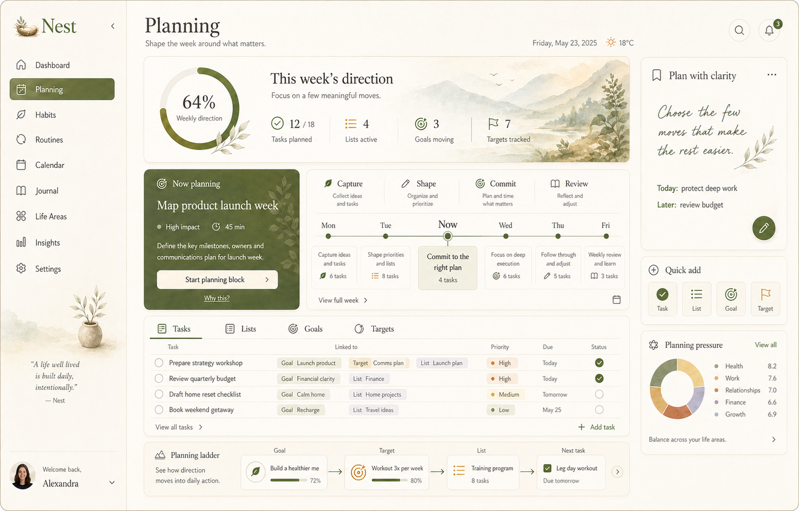

# NEST-261 Planning Canonical Direction (2026-04-30)

## Purpose

Define the canonical desktop direction for the Nest `Planning` module so future
implementation work can align tasks, lists, goals, and targets into one calm,
premium planning room.

This visual is not inspiration. It is the approved reference for the Planning
module's first serious canonical rebuild.

## Source Type And Approval Context

- Source of truth type: `approved_snapshot`
- Approval context: founder-approved Planning concept on 2026-04-30
- Canonical artifact:
  - `docs/ux_canonical_artifacts/2026-04-30/nest-planning-canonical-reference.png`
- Fidelity target: structurally faithful first, then progressively
  screenshot-close as shared dashboard materials become reusable.
- Supporting repository truth:
  - `docs/ux/visual-direction-brief.md`
  - `docs/ux/brand-personality-tokens.md`
  - `docs/ux/design-memory.md`
  - `docs/ux/canonical-visual-implementation-workflow.md`
  - `docs/architecture/domain_model.md`
  - `docs/architecture/modules.md`
  - `docs/architecture/v1_v2_delivery_split.md`
  - `apps/web/src/app/tasks/page.tsx`

## Canonical Preview

## Planning Job To Be Done

Planning is the user's calm command room for turning intention into executable
life structure. It must answer:

1. What is this week oriented around?
2. What should I plan next?
3. How do tasks, lists, goals, and targets connect?
4. Where is pressure building before it becomes chaos?

The module should feel more like thoughtful life orchestration than task
administration.

## Canonical Experience Principles

- Keep one integrated Planning module for `Tasks`, `Lists`, `Goals`, and
  `Targets`; do not split the mental model into disconnected pages.
- Lead with weekly direction before detailed operational rows.
- Preserve one dominant `Now planning` action card.
- Show the goal-to-action chain visually: `Goal -> Target -> List -> Next task`.
- Keep the lower task workspace dense, but softer and more relational than a
  spreadsheet.
- Use the right rail for clarity, quick creation, and pressure awareness, not
  for generic stats.
- Keep the sidebar and shell aligned with the dashboard canonical family.

## Information Architecture

The canonical desktop Planning screen is composed from six layers.

### 1. Shared Workspace Shell

- Preserve the existing Nest rail structure and account/footer treatment.
- `Planning` is the active rail item.
- Header rhythm follows the dashboard: page title, concise subtitle, date,
  weather, search, and notification controls.

### 2. Weekly Direction Hero

- Wide editorial hero band with painterly mountain and foliage wash.
- Circular weekly progress readout.
- Four compact metrics:
  - tasks planned,
  - lists active,
  - goals moving,
  - targets tracked.
- The hero is strategic orientation, not a decorative banner.

### 3. Dominant `Now Planning` Card

- Deep olive material card similar to dashboard `Now focus`.
- Contains one recommended planning action, impact metadata, duration, and one
  primary CTA.
- This card should visually outrank the week flow and task board.

### 4. Weekly Planning Flow

- Planning stages appear as `Capture`, `Shape`, `Commit`, and `Review`.
- The week rail keeps `Now` centered and highlighted.
- Task clusters should stay readable and intentional; avoid calendar noise.

### 5. Relational Planning Workspace

- Tabbed surface: `Tasks`, `Lists`, `Goals`, `Targets`.
- `Tasks` is the canonical default tab.
- Rows should show task title plus relational context chips for goal, target,
  and list where available.
- Priority, due date, and status remain visible without turning the module into
  a back-office table.

### 6. Planning Ladder And Support Rail

- The bottom ladder demonstrates the product model:
  `Goal -> Target -> List -> Next task`.
- The right rail contains:
  - `Plan with clarity`,
  - `Quick add`,
  - `Planning pressure`.
- These panels are support context and should stay lighter than the main work
  lane.

## Visual Direction

- Mood: calm utility, editorial precision, warm guidance.
- Palette: warm ivory, parchment, moss, olive, sage, soft gold, clay, and
  charcoal-brown type.
- Materials: paper grain, painterly wash, thin beige borders, soft shadows,
  botanical texture.
- Hierarchy: one hero, one dominant action card, one operational board, one
  source-of-truth ladder, one quiet support rail.

## Implementation Notes

- Reuse dashboard shell and material primitives before introducing route-local
  Planning styling.
- Promote reusable primitives when Planning needs a pattern that can also serve
  Calendar, Goals, or Dashboard.
- Painterly hero and card atmospheres may require raster assets; do not flatten
  them into generic gradients if visual parity starts to drift.
- Preserve web/mobile parity for the core module model even if mobile uses a
  different layout.

## Required States

The canonical Planning implementation must design:

- `loading`: skeletons that preserve hero, flow, board, and rail hierarchy.
- `empty`: starter guidance for first task/list/goal/target setup.
- `error`: local recovery copy near the failed surface.
- `success`: confirmation near the action source.
- `high-load`: triage pressure and next planning action instead of dumping all
  overdue work equally.

## Anti-Drift Rules

- Do not replace the Planning view with a generic Kanban board.
- Do not make `Tasks`, `Lists`, `Goals`, and `Targets` feel like four separate
  apps.
- Do not remove the Planning ladder; it is the canonical explanation of the
  module model.
- Do not change the sidebar to make the Planning screen work.
- Do not make all cards equal weight.
- Do not treat painterly surfaces as optional if the target is screenshot
  faithful.

## Acceptance Criteria For Canonical Adoption

Planning is correctly aligned when:

- weekly direction is obvious within the first viewport,
- `Now planning` is the clearest next action,
- tasks visibly connect to lists, goals, and targets,
- the planning ladder explains the domain chain at a glance,
- the right rail supports clarity and pressure awareness without competing,
- the screen reads as a sibling of the canonical dashboard,
- desktop, tablet, and mobile adaptations preserve the same mental model.
