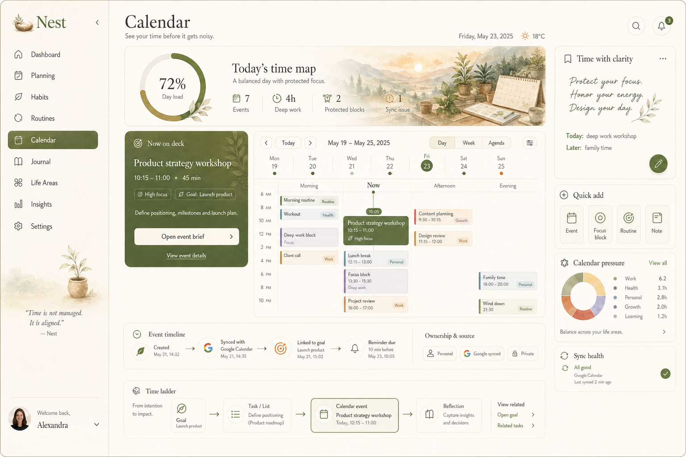
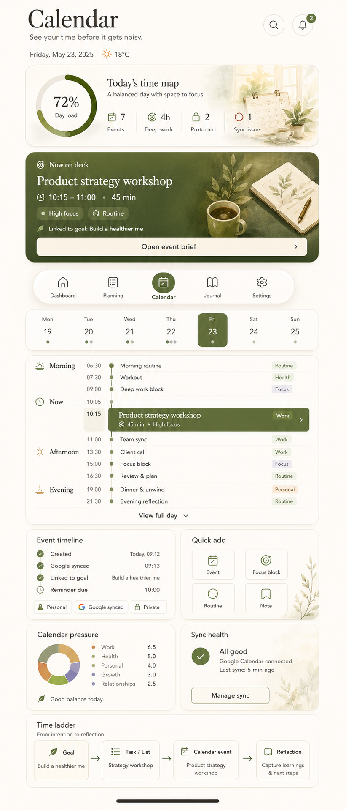

# NEST-268 Calendar Canonical Direction (2026-04-30)

## Purpose

Define the canonical desktop and mobile direction for the Nest `Calendar`
module so future implementation work can turn event browsing into a calm,
context-rich time command surface.

This visual is not inspiration. It is the approved reference for the Calendar
module's first serious canonical rebuild.

## Source Type And Approval Context

- Source of truth type: `approved_snapshot`
- Approval context: founder-approved Calendar concept on 2026-04-30
- Canonical artifacts:
  - `docs/ux_canonical_artifacts/2026-04-30/nest-calendar-canonical-reference-desktop.png`
  - `docs/ux_canonical_artifacts/2026-04-30/nest-calendar-canonical-reference-mobile.png`
- Fidelity target: structurally faithful first, then progressively
  screenshot-close as shared dashboard and planning materials become reusable.
- Supporting repository truth:
  - `docs/ux/visual-direction-brief.md`
  - `docs/ux/brand-personality-tokens.md`
  - `docs/ux/design-memory.md`
  - `docs/ux/canonical-visual-implementation-workflow.md`
  - `docs/architecture/domain_model.md`
  - `docs/architecture/modules.md`
  - `docs/engineering/contracts/openapi_core_modules_v1.yaml`

## Canonical Preview

## Calendar Job To Be Done

Calendar is the user's calm time map for seeing what the day is asking from
them before it becomes noise. It must answer:

1. What is happening today, and how loaded is the day?
2. What needs attention next?
3. Where are conflicts, sync issues, or pressure building?
4. How does this event connect to goals, tasks, life areas, and reflection?

The module should feel like thoughtful time orchestration, not a generic
calendar clone.

## Canonical Experience Principles

- Lead with `Today's time map`, not a raw month grid.
- Preserve one dominant `Now on deck` action card.
- Use a hybrid day timeline plus week strip for scanning and orientation.
- Expose event intelligence through source, sync, privacy, and assignment
  timeline cues.
- Keep the right rail supportive: guidance, quick add, pressure, and sync
  health.
- Preserve the same mental model on mobile through stacked hierarchy rather
  than compressed desktop columns.

## Information Architecture

The canonical Calendar screen is composed from seven layers.

### 1. Shared Workspace Shell

- Preserve the existing Nest rail structure and account/footer treatment.
- `Calendar` is the active rail item.
- Header rhythm follows dashboard and planning: page title, concise subtitle,
  date, weather, search, and notification controls.

### 2. Today's Time Map

- Wide editorial hero band with a day-load progress readout.
- Compact metrics:
  - events today,
  - deep work,
  - protected blocks,
  - sync issues.
- The hero is situational awareness, not decoration.

### 3. Dominant `Now On Deck` Card

- Deep olive material card similar to dashboard `Now focus` and planning
  `Now planning`.
- Contains the next event, time range, duration, focus or energy signal,
  linked goal or task context, and a primary event brief CTA.

### 4. Time Flow Calendar Surface

- Week strip gives date context and event-density dots.
- Day timeline is grouped as `Morning`, `Now`, `Afternoon`, and `Evening`.
- The current time is visually centered and emphasized.
- Event blocks show type, source, conflict, and life-area context without
  turning the surface into a dense scheduling back office.

### 5. Event Intelligence

- Selected event panel exposes:
  - source and ownership badges,
  - Google sync state,
  - privacy or scope,
  - linked goal/task/list context,
  - assignment timeline.
- The backend endpoint
  `/v1/calendar-events/{eventId}/assignment-timeline` should power this
  intelligence when available.

### 6. Support Rail

- `Time with clarity`: short guidance for protecting the day.
- `Quick add`: Event, Focus block, Routine, and Note actions.
- `Calendar pressure`: compact life-area or energy distribution.
- `Sync health`: low-noise integration status and recovery affordance.

### 7. Time Ladder

- Bottom strip demonstrates the product model:
  `Goal -> Task/List -> Calendar event -> Reflection`.
- This turns calendar events from isolated blocks into part of the Nest loop.

## Mobile Direction

- Keep one primary job per screen: understand today and the next event.
- Stack hero, now card, week strip, timeline, event intelligence, and support
  surfaces in that order.
- Use thumb-friendly action zones for quick add and event brief entry.
- Preserve parity with desktop semantics even when layout differs.

## Required States

The canonical Calendar implementation must design:

- `loading`: skeletons that preserve hero, now card, timeline, and support
  hierarchy.
- `empty`: setup guidance for creating the first event or connecting a calendar.
- `error`: local recovery near the failed events or sync surface.
- `success`: confirmation near event creation or update.
- `sync_conflict`: clear conflict source, affected event, and recovery action.
- `high_load`: triage guidance instead of dumping all events equally.

## Anti-Drift Rules

- Do not replace Calendar with a generic month grid as the primary surface.
- Do not copy Google Calendar's visual model without Nest's context layer.
- Do not make all event cards equal weight.
- Do not hide sync, privacy, or ownership cues when they affect trust.
- Do not split mobile into unrelated feature cards that lose the day-flow model.
- Do not treat painterly surfaces as optional if the target is
  screenshot-faithful.

## Acceptance Criteria For Canonical Adoption

Calendar is correctly aligned when:

- day load is obvious within the first viewport,
- `Now on deck` is the clearest next action,
- timeline scanning is faster than reading a raw agenda,
- event intelligence shows source, sync, ownership, and assignment history,
- support rail improves clarity without competing,
- desktop and mobile preserve the same mental model,
- the screen reads as a sibling of the canonical dashboard and planning module.
