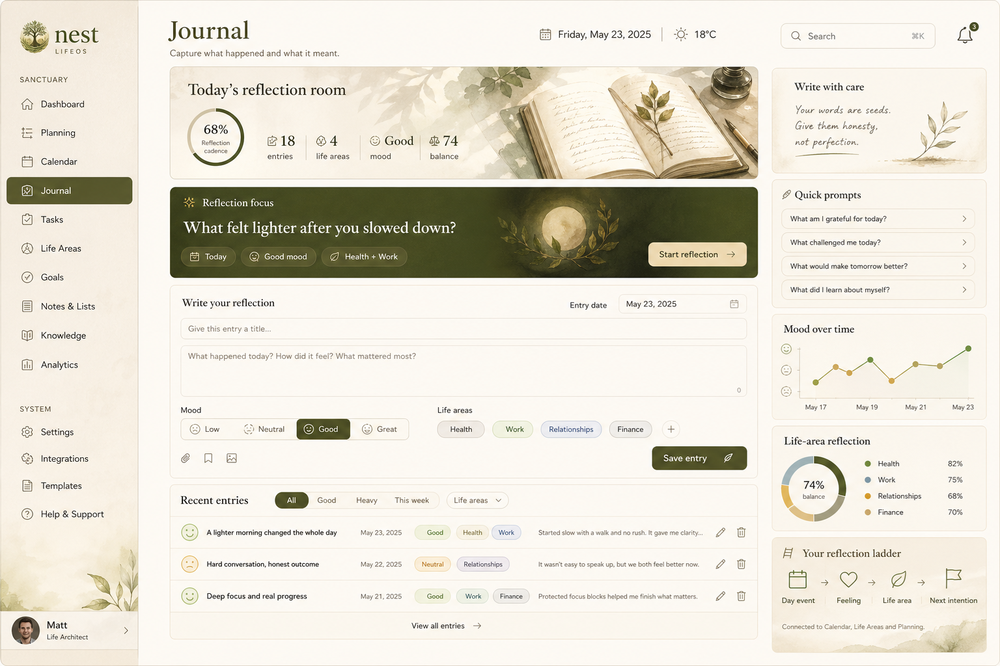
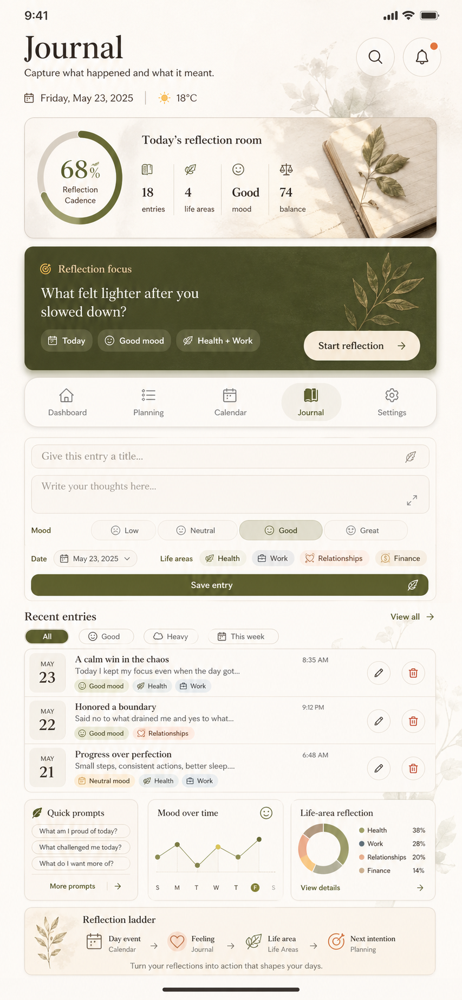

# NEST-269 Journal Canonical Direction (2026-04-30)

## Purpose

Define the canonical desktop and mobile direction for the Nest `Journal`
module so future implementation work can turn reflection capture into a warm,
context-rich LifeOS surface.

The module name is `Journal`. Reflection remains the core behavior, but the UI
must not label the module as `Journal + Reflection` or `Reflections`.

This visual is not inspiration. It is the approved reference for the Journal
module's next canonical rebuild.

## Source Type And Approval Context

- Source of truth type: `approved_snapshot`
- Approval context: founder-approved Journal concept on 2026-04-30
- Canonical artifacts:
  - `docs/ux_canonical_artifacts/2026-04-30/nest-journal-canonical-reference-desktop.png`
  - `docs/ux_canonical_artifacts/2026-04-30/nest-journal-canonical-reference-mobile.png`
- Fidelity target: structurally faithful first, then progressively
  screenshot-close as shared dashboard, planning, and calendar materials become
  reusable.
- Supporting repository truth:
  - `docs/ux/visual-direction-brief.md`
  - `docs/ux/brand-personality-tokens.md`
  - `docs/ux/design-memory.md`
  - `docs/ux/canonical-visual-implementation-workflow.md`
  - `docs/architecture/domain_model.md`
  - `docs/architecture/modules.md`
  - `docs/engineering/contracts/openapi_core_modules_v1.yaml`
  - `apps/web/src/app/journal/page.tsx`

## Canonical Preview

## Journal Job To Be Done

Journal is the user's warm reflection room for capturing what happened, how it
felt, and what deserves more care. It must answer:

1. What is worth reflecting on today?
2. How can I capture the entry quickly without making it feel clinical?
3. What mood and life-area context belongs with this entry?
4. How do recent entries reveal patterns across life areas and time?

The module should feel like thoughtful self-review, not a generic notes app,
therapy app, AI chat, or administrative CRUD surface.

## Canonical Experience Principles

- Name the module `Journal` everywhere.
- Lead with `Today's reflection room` before the entry form.
- Preserve one dominant `Reflection focus` card.
- Make writing feel warm, immediate, and low-friction.
- Keep mood and life-area context visible without overwhelming the composer.
- Let recent entries read like a living memory, not a back-office table.
- Preserve mobile parity through stacked hierarchy and thumb-friendly controls.

## Information Architecture

The canonical Journal screen is composed from seven layers.

### 1. Shared Workspace Shell

- Preserve the existing Nest rail structure and account/footer treatment.
- `Journal` is the active rail item.
- Header rhythm follows dashboard, planning, and calendar: page title, concise
  subtitle, date, weather, search, and notification controls.

### 2. Today's Reflection Room

- Wide editorial hero band with reflection cadence or readiness readout.
- Compact metrics:
  - entries,
  - life areas,
  - latest or current mood,
  - balance signal.
- The hero is emotional orientation, not decoration.

### 3. Dominant `Reflection Focus` Card

- Deep olive material card aligned with dashboard `Now focus`, planning
  `Now planning`, and calendar `Now on deck`.
- Contains one guided prompt, current context chips, and a primary
  `Start reflection` CTA.

### 4. Reflection Composer

- Warm writing surface with:
  - title,
  - body,
  - mood control,
  - entry date,
  - life-area chips,
  - primary save action.
- Preserve the backend contract for journal entries:
  title, body, mood, entry date, and life-area ids.
- The composer should feel human and inviting, not transactional.

### 5. Recent Entries Workspace

- Recent entries show title, date, mood, life-area chips, excerpt, and subtle
  edit/delete affordances.
- Filters may include `All`, `Good`, `Heavy`, `This week`, and `Life areas`.
- Keep rows dense enough for review but soft enough for reflection.

### 6. Support Rail

- `Write with care`: short reflection guidance.
- `Quick prompts`: lightweight prompts that help entry creation.
- `Mood over time`: compact trend signal.
- `Life-area reflection`: compact distribution or balance summary.

### 7. Reflection Ladder

- Bottom strip demonstrates the product model:
  `Day event -> Feeling -> Life area -> Next intention`.
- This connects Journal to Calendar, Life Areas, Planning, and Dashboard
  without inventing unsupported automation.

## Mobile Direction

- Keep one primary job per screen: capture one useful reflection.
- Stack hero, focus card, composer, recent entries, support cards, and ladder
  in that order.
- Keep mood and life-area controls thumb-friendly.
- Preserve the same semantic model as desktop instead of reducing mobile to a
  generic notes list.

## Required States

The canonical Journal implementation must design:

- `loading`: skeletons that preserve hero, focus card, composer, and recent
  entries hierarchy.
- `empty`: starter guidance for the first journal entry and first life-area
  connection.
- `error`: local recovery near the failed entry or life-area surface.
- `success`: confirmation near the save or update action.
- `editing`: entry editing that preserves the canonical row or card rhythm.
- `high_volume`: review filters and grouped entries instead of dumping all
  reflections equally.

## Anti-Drift Rules

- Do not label the module `Journal + Reflection` or `Reflections`.
- Do not turn Journal into a generic notes app.
- Do not replace the composer with an AI chat surface.
- Do not make reflection feel clinical, childish, or overly decorative.
- Do not hide mood and life-area context when they are available.
- Do not make recent entries an equal-weight feed that competes with capture.
- Do not treat painterly surfaces as optional if the target is
  screenshot-faithful.

## Acceptance Criteria For Canonical Adoption

Journal is correctly aligned when:

- `Journal` is the only module name,
- reflection focus is obvious within the first viewport,
- the composer feels warm and efficient,
- mood and life-area context are visible and useful,
- recent entries support review without dominating capture,
- desktop and mobile preserve the same mental model,
- the screen reads as a sibling of the canonical dashboard, planning, and
  calendar modules.
