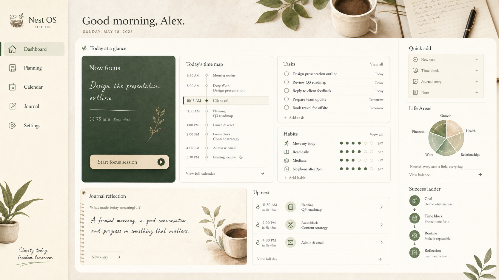
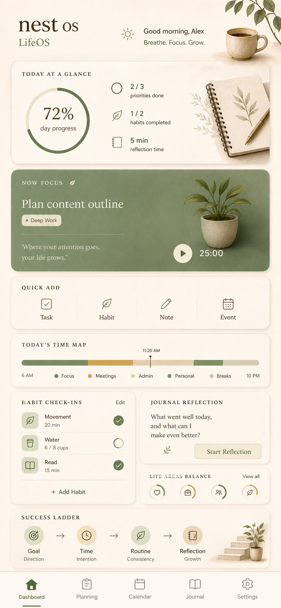

# Nest OS Canonical View Architecture (2026-05-02)

## Purpose

This document records the current Nest OS information architecture rule for
future UI generation and implementation. Nest is a calm life operating system,
not a flat productivity tracker, so powerful domain modules must be revealed
through a small number of stable rooms.

## Canonical Pillars

The primary navigation should expose five pillars only:

- `Dashboard`: today, now focus, habits/routines, reflection cues, life-area
  balance, and the daily success ladder.
- `Planning`: goals, targets, lists, tasks, weekly direction, relational rows,
  and the planning ladder.
- `Calendar`: time map, events, routines scheduled into time, and the time
  ladder.
- `Journal`: reflection, moods, entries, life-area learning, and balance
  interpretation.
- `Settings`: account, language, sync, support, optional surfaces, and advanced
  controls.

Do not expose `Habits`, `Routines`, `Goals`, `Targets`, `Lists`, `Tasks`, or
`Life Areas` as equal top-level peers when designing canonical navigation.
They remain first-class domain modules, but their UI entry points should be
progressively disclosed inside the five pillars above.

## Dashboard Contract

Dashboard must answer three questions within the first meaningful viewport:

1. What matters today?
2. What deserves attention now?
3. How does this action connect to the larger life system?

Required Dashboard regions:

- warm shell with five-pillar navigation
- `Today at a glance` progress hero
- dominant `Now focus` action
- `Today's time map` or day-flow timeline
- execution panels for tasks and habits/routines
- quick add for task, habit, note, and event
- journal/reflection cue
- life-area balance cue
- success ladder connecting `Goal -> Time -> Routine -> Reflection`

## Platform Split

Desktop and tablet web:

- favor orchestration, scanning, and deeper planning density
- keep the left rail visible when there is room
- allow multi-column panels when they reduce cognitive load
- preserve calm hierarchy over symmetrical card grids

Mobile:

- favor quick capture, check-ins, reminders, and daily execution
- keep exactly five bottom-nav pillars
- show one primary job at a time
- stack Dashboard as: header, progress, now focus, quick add, time map,
  check-ins, reflection, balance, success ladder

Mobile app runtime remains V2 scope after the 2026-05-02 decision, but mobile
canonical previews and responsive web targets should follow this hierarchy now.

## Canonical Preview Artifacts

Desktop:

Mobile:

## Implementation Notes

- Prefer existing shared dashboard primitives and painterly assets before
  creating route-local styling.
- When adding creation flows, always offer context for linking to a goal,
  target, list, event, or life area when that relationship exists.
- If a screen starts feeling like corporate analytics or a spreadsheet, remove
  equal-weight panels before adding more visual decoration.
- Quiet mentor microcopy is preferred over KPI pressure language.
